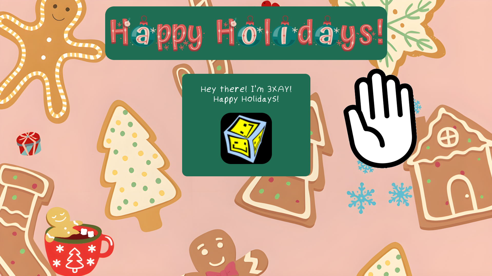

# christmasThemedWebsite2024
My submission for the Winter Boba Drop by Hack Club.
This was actually super useful, because although I have a website and I know a small amount of HTML/CSS, I didn't know enough to make a whole website.
I've always relied on tools like MkDocs to do the bulk of the work so I could focus on the content and basic styling, but this was a super helpful project.

(Only tested on a 1920x1080 display, may look more "empty" on high res displays, may not work well with displays that aren't 16:9)

Credits:
- Background: Made by me using Canva and its royalty free images + templates
- Header font: [Image by undefined](https://www.freepik.com/font/christmas-charm) on Freepik
- Logo: Me
- Waving hand gif: Locobobo